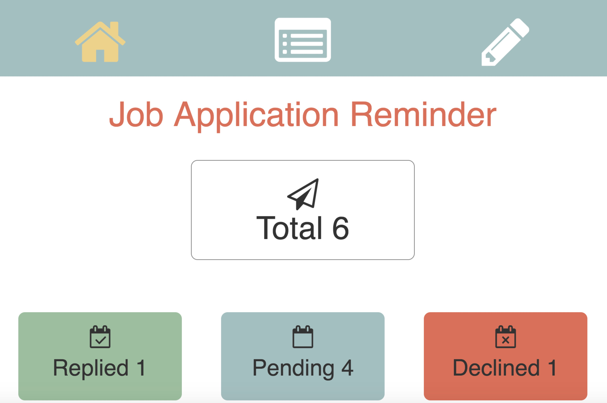
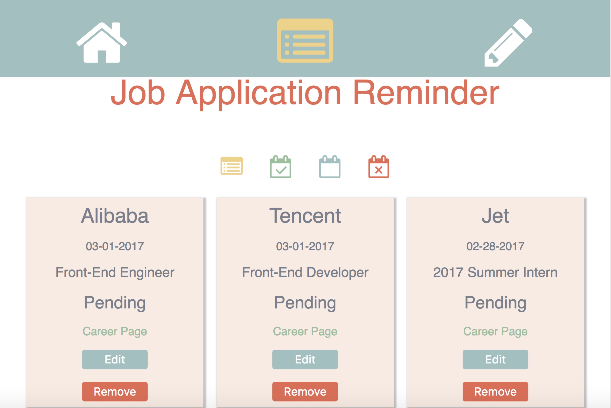
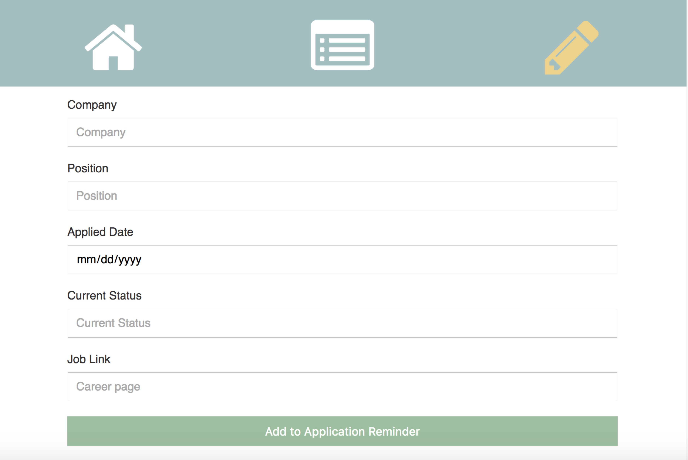
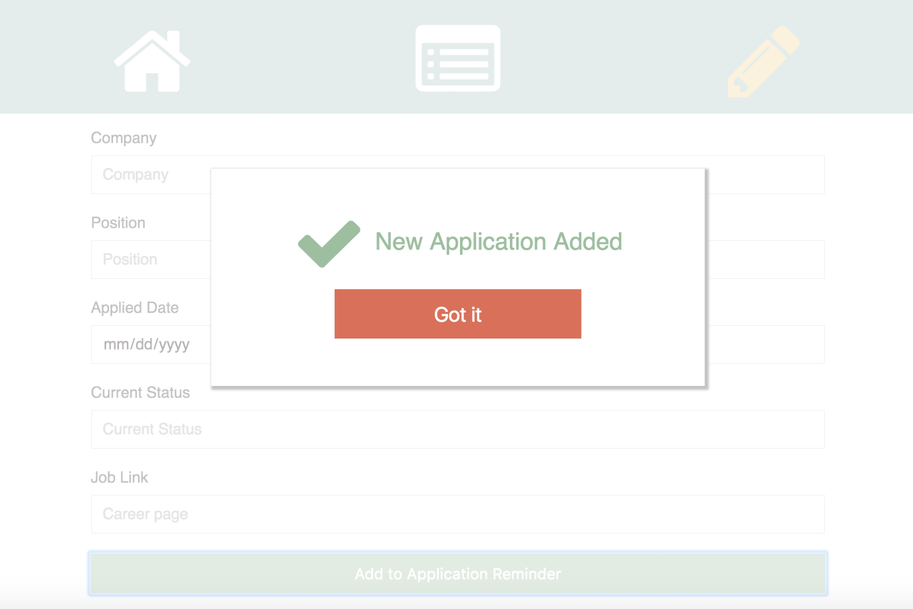

# Job-Reminder
A simple app practicing React.js

# Description

## V3.0
Now This App is refined with ```MobX```, currently based on ```React + MobX + React-Router```.      
[Job Reminder Demo](https://robbyvan.github.io/jobReminder-mobx-v3.0/dist/#/)

## V2.0    
Now This App is refined with ```Redux```, currently based on ```React + Redux + React-Router```.

+ Components(Dump)
  - AppRoutes
  - Menu
  - JobBoardNav
+ Containers(Smart)
  - App
  - JobCount
  - JobBoard
    + JobBlock
  - AddJobForm
    + PopUp
+ Actions
  - ADD_JOB, EDIT_JOB, FILTER_JOB, SAVE_JOB, REMOVE_JOB, TOGGLE_POPUP
+ Reducers:
  - JobReducer
  - filteredJobsReducer
  - UIReducer

## V1.0    
This App is based on ```React + React-Router```.<br />
```
Components: App -> JobCount / JobBoard / AddJobForm -> JobBlock
```
An app to help me remember positions I've applied for.<br />

# Views
## Homepage


## Application List


## Add Form


## Confirmation

